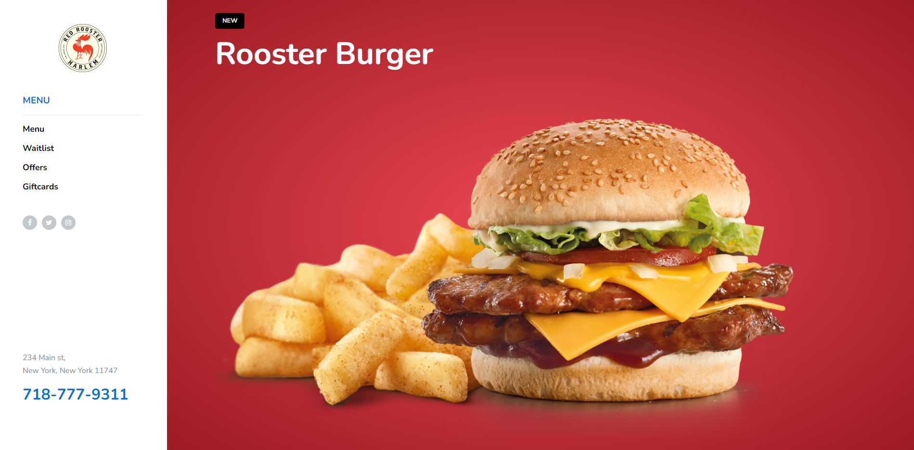
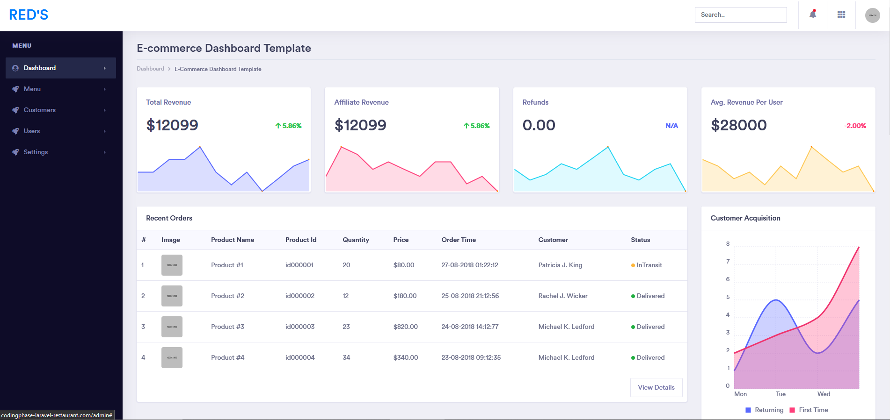

# 🚀 Restaurant Website

<!-- PROJECT IMAGES -->

<!-- MAIN WEBSITE IMAGE -->
	<table>
		<tr>
			<td width="50%">
        <h3 align="center">🛠️ Restuarant Website</h3>
				
  
					
				

			</td>  
			<td width="50%">
				<h3 align="center">🛠️ Admin Dashboard </h3>
				
  
					
				

      </td>
    </tr>
  </table>
   
   
    <tr>
      <td width="100%">
        <h3 align="center">🚀 My restaurant website</h3>
         
        

          

              
            
          

          

            
          

          

            
          

           
           
          
<strong>How It's Made</strong>

        

      </td>
      </tr>
  </table>

Write a short sentence or two about this project and what it does. Be sure to include a link and a screenshot (we're front end devs so we can actually see our work!)..

Here's where you can go to town on how you actually built this thing. Write as much as you can here, it's totally fine if it's not too much just make sure you write _something_. If you don't have too much experience on your resume working on the front end that's totally fine. This is where you can really show off your passion and make up for that ten fold.
 
 